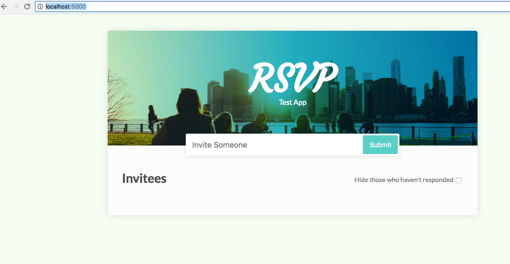
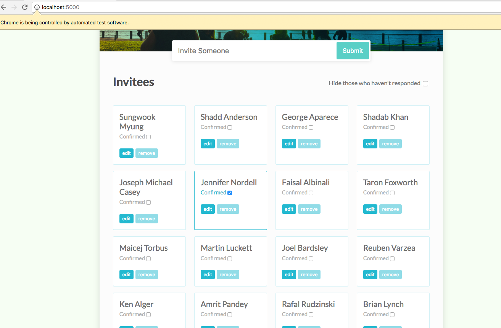

# Build Selenium Automation Tool  

This Selenium automataion tool is for testing the project browser served in the same folder.  

### Required Skills: Selenium, Node.js, Express 

## How to run the project
### Setup the application 
Open a Command Prompt (on Windows) or Terminal (on Mac OS X and Linux) instance and browse to the root project folder.
```
$ git clone https://github.com/seanmyung/seleniumJs.git
$ cd seleniumJs
```
### Install the application
Run the command `npm install` to install the required dependencies.
```
$ npm install 
```
### Run the application
Run the command `npm start` to run the application.
```
npm start
```
### View the web bowser
To test your application, open your web browser and browse to `http://localhost:5000/`
```
http://localhost:5000
```
### Open another Command Prompt or Terminal

### Run the Selenium automation tool 
```
URL=http://localhost:5000/ node index.js
```
### Stop the program 
You can press `Ctrl-C` to stop the application 

## Images In ReadMes
### Web browser

### After Running the automation tool
